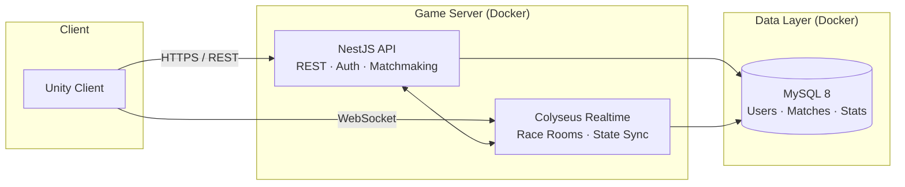

# Racing PvP

> An open learning project that demonstrates a full-stack, realtime PvP racing system — from the game server architecture to the Unity client.

[](https://nodejs.org/)
[](https://nestjs.com/)
[](https://colyseus.io/)
[](https://www.mysql.com/)
[](https://www.docker.com/)
[](https://unity.com/)
[](https://opensource.org/licenses/MIT)
[](#contributing)

---

## About

**Racing PvP** is a reference implementation and learning resource for building a competitive, realtime multiplayer racing game. The repository walks through every layer of the stack — containerized infrastructure, a relational data model, a backend API, an authoritative realtime game server, and a Unity client — so that anyone studying PvP game systems can read, run, and extend a working example.

The goal is not just to ship a game, but to make the design choices behind a modern PvP server visible: matchmaking, room lifecycle, state synchronization, anti-cheat boundaries, persistence, and deployment.

---

## Tech Stack

| Layer            | Technology                              | Responsibility                                                    |
| ---------------- | --------------------------------------- | ----------------------------------------------------------------- |
| Infrastructure   | **Docker** & Docker Compose             | Reproducible local and production environments                    |
| Database         | **MySQL 8**                             | Persistent storage for accounts, profiles, matches, leaderboards  |
| Backend API      | **NestJS** (TypeScript)                 | Auth, profile, matchmaking, REST/gRPC endpoints, business logic   |
| Realtime Server  | **Colyseus**                            | Authoritative game rooms, state sync, tick loop, race simulation  |
| Client           | **Unity** (2022 LTS)                    | Rendering, input, prediction, reconciliation, UI                  |

---

## Architecture



**Flow at a glance**

1. The Unity client authenticates and fetches profile data from the **NestJS API** over REST.
2. When a player queues for a match, NestJS runs matchmaking and assigns them to a **Colyseus** room.
3. The client opens a WebSocket to that room; Colyseus runs the authoritative race simulation and broadcasts state.
4. On race completion, results are persisted to **MySQL** for stats, leaderboards, and match history.
5. Everything runs in **Docker** containers, orchestrated through a single `docker-compose.yml`.

---

## Project Structure

```
racing-pvp/
├── docker/                 # Dockerfiles and orchestration
│   ├── api.Dockerfile
│   ├── realtime.Dockerfile
│   └── mysql/
│       └── init.sql        # Schema bootstrap
├── database/               # Migrations, seeds, ER diagrams
│   ├── migrations/
│   └── seeds/
├── server/
│   ├── api/                # NestJS application (auth, profile, matchmaking)
│   │   ├── src/
│   │   ├── test/
│   │   └── package.json
│   └── realtime/           # Colyseus application (rooms, race logic)
│       ├── src/
│       │   ├── rooms/
│       │   ├── schemas/
│       │   └── index.ts
│       └── package.json
├── client/
│   └── unity/              # Unity project (Assets, Packages, ProjectSettings)
├── docs/                   # Architecture notes, diagrams, design decisions
├── docker-compose.yml
├── .env.example
└── README.md
```

> The folders above describe the intended layout. As modules land in the repo, each directory will gain its own README with deeper notes.

---

## Quick Start

### Prerequisites

- [Docker](https://www.docker.com/) **24+** and Docker Compose v2
- [Node.js](https://nodejs.org/) **20.x** (only if you want to run server modules outside Docker)
- [Unity Hub](https://unity.com/download) with **Unity 2022 LTS** (for the client)
- Git

### 1. Clone the repository

```bash
git clone https://github.com/<your-org>/racing-pvp.git
cd racing-pvp
```

### 2. Configure environment variables

```bash
cp .env.example .env
```

Open `.env` and adjust the database credentials, JWT secret, and exposed ports to match your machine.

### 3. Bring the stack up with Docker

```bash
docker compose up -d --build
```

This starts three services:

| Service     | Default Port | Description                       |
| ----------- | ------------ | --------------------------------- |
| `mysql`     | `3306`       | MySQL 8 with the seeded schema    |
| `api`       | `3000`       | NestJS REST API                   |
| `realtime`  | `2567`       | Colyseus WebSocket server         |

Check health:

```bash
docker compose ps
curl http://localhost:3000/health
```

### 4. Run database migrations

```bash
docker compose exec api npm run migration:run
```

### 5. Open the Unity client

1. Launch **Unity Hub** and add the `client/unity` folder as a project.
2. Open the project in **Unity 2022 LTS**.
3. In the `Resources/Config` asset, point the API URL to `http://localhost:3000` and the realtime URL to `ws://localhost:2567`.
4. Press **Play** to connect against your local stack.

### 6. Tear it down

```bash
docker compose down -v
```

---

## Development Tips

- **Hot reload during server work** — run the NestJS or Colyseus module outside Docker (`npm run start:dev`) and keep only MySQL inside Compose for a tight feedback loop.
- **Inspect realtime rooms** — Colyseus ships with a monitor panel at `http://localhost:2567/colyseus`.
- **Database GUI** — connect any MySQL client (TablePlus, DBeaver, MySQL Workbench) to `localhost:3306` using the credentials from your `.env`.
- **Logs** — `docker compose logs -f api realtime` streams both server modules side by side.

---

## Contributing

This repo is intentionally educational. Issues, discussions, and pull requests that improve clarity, add diagrams, or extend the simulation are all welcome. If you are learning PvP system design, feel free to open a discussion with questions — the answers usually become better documentation.

---

## License

Released under the [MIT License](LICENSE). Use it, fork it, learn from it.
